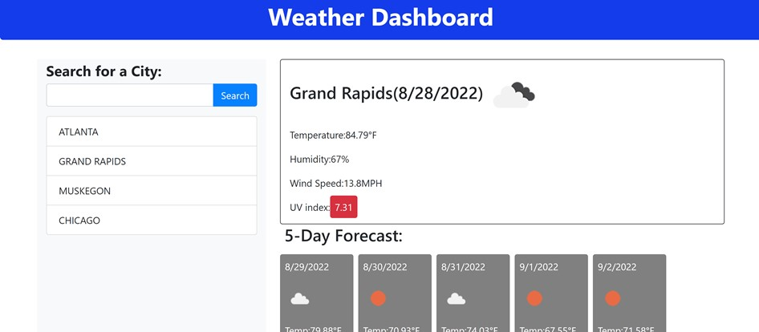

# Weather-Dashboard

## Descrpition 
This webpage displays the current weather in a searched location. This webpage also displays the 5 day forecast for the location. A user will type in a location into the search bar. The page will then show the temperature, wind speeds huminity, and UV index. Additioanlly, there will be an icon which represents the weather conditions. Once the search has been made, the location will be saved into the search history.

## Installation
link to website: https://github.com/ckrum21/Weather-Dashboard
link to GitHub: https://github.com/ckrum21 

Install this website by cloning the code to your local devices.

software required to download this website:
* GitBash or other terminal
* Visual Studio Code

## Usage

The code used for this webpage is HTML, CSS, and JavaScript. Additonally, as API is used to produce the weather data. The code for this website is used to display the current weather, future weather, and the search history

## Credits
Chelsea Krum 